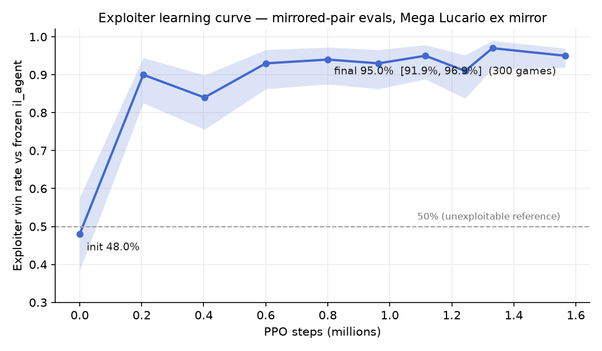

# Exploiter-agent diagnostic: how exploitable is il_agent?

**Date:** 2026-08-04 · **Run tag:** `exploiter_v1` · **Branch:** `claude/ptcg-exploiter-agent-b80eab`

**Headline:** a PPO exploiter initialized *from il_agent's own checkpoint* and
trained ~1.57M steps against the frozen il_agent reaches a

> **95.0% win rate over 300 mirrored games (285W/15L/0D), Wilson 95% CI [91.9%, 96.9%]**

in the Mega Lucario ex mirror. il_agent has large, *specific*, reproducible
policy weaknesses — enumerated in §5. In 15 of 25 inspected losses il_agent
took **zero prizes**.

Idea source: AlphaStar's exploiter agents and the Minimax Exploiter paper
(arXiv 2311.17190). Both reject pure symmetric self-play for weakness-finding;
a dedicated adversary vs a FROZEN target is the diagnostic. (The paper's
opponent-Q-value reward shaping is inapplicable here: il_agent is a pure IL
policy with no Q/value head, so plain win/loss reward vs a stationary opponent
was used — which is exactly what makes this cheap: it is single-agent RL.)

---

## 1. Interpretation guardrails (read first)

- **A 95% exploiter win rate means il_agent HAS exploitable weaknesses — not
  that ladder opponents are exploiting them.** Ladder opponents are not
  optimizing against us; this adversary trained ~1.57M steps against this one
  frozen policy. Diagnostic, not a deployment candidate.
  **The exploiter must NEVER be submitted to Kaggle.**
- Ladder context at analysis time (2026-08-04, `check_leaderboard.py`): rank
  **2256/6245** at team score **703.2** (best-ever 804.0, currently displaced
  from the active set). Nothing in this experiment changes ladder claims; no
  submission was made.
- Had the result been ~50% after real training, that would have meant "locally
  hard to exploit at this architecture/budget" — also informative. That is not
  what happened.
- The exploiter was **initialized from il_agent** (fast convergence, shared
  architecture). A from-scratch exploiter might find *different* weaknesses;
  out of scope for v1.

## 2. Setup

| Piece | Choice | Why |
|---|---|---|
| Opponent | `il_agent` via `benchmark_agents.load_agent` — its shipped `agent_core.py` + its own `deck.csv`, greedy argmax, **frozen** | The real inference path our benchmarks use |
| Exploiter init | `models/il_agent` checkpoint (same weights/arch; fresh value head) | Fast convergence; isolates "what can this architecture find wrong with itself" |
| Deck | **Both sides play il_agent's bundled deck** (`agents/il_agent/deck.csv`) | Mirror match isolates POLICY weaknesses from deck matchup |
| Trainer | `train_ppo_puffer.py --opponent-module il_agent --kl-coef 0 --init-from models/il_agent` (new exploiter mode) | PufferLib 3.0 PPO; KL anchor deliberately OFF — the exploiter must be free to drift |
| Reward | Terminal {0, 0.5, 1} | Affine-equivalent to the spec's +1/−1 (shift absorbed by the value baseline, scale by LR); kept the harness's proven form |
| Seats | **Strictly alternate every episode** (new `alternate_seats` in `PTCGGym`) | No first-player-only exploits |
| Eval | `eval_exploiter.py`: mirrored pairs, exploiter samples at T=1.0 (the distribution PPO optimizes), Wilson CIs, per-seat split | play_match convention; cancels first-player advantage |

⚠️ **Deck caveat, stated loudly:** the task brief described il_agent as
"piloting a Grimmsnarl ex deck". The deck actually bundled with il_agent in
this repo's harness — and therefore played by BOTH sides here — is the **Mega
Lucario ex sample deck** (cards 673–678 + trainers; `agents/il_agent/deck.csv`
≠ `configs/deck_lists/marnies_grimmsnarl_ex.csv`). The mirror-isolation
property holds regardless, but every finding below is "il_agent's policy in
the Lucario mirror". A Grimmsnarl-mirror v2 is one flag away
(`il_agent@marnies_grimmsnarl_ex` deck-tag + a deck parameter for the env);
see §7.

## 3. Validity: the fallback gate

An exploiter that beats `_safe_choice` instead of the model would invalidate
everything, so this was checked **first** and re-checked after training
(`PTCG_FALLBACK_TRACK=1` throughout):

| Check | Harness | Result |
|---|---|---|
| Pre-training smoke | benchmark (`fallback_diagnostic.py`) | **0/103 = 0.00%** |
| Pre-training, training wrapper | `PTCGGym` + random-legal learner (new `fallback_probe_puffer_env.py`) | **0/267 = 0.00%** |
| Negative control (tracker proven live) | empty `IL_MODEL_DIR` | **100%** `model_unavailable:load_failed` ✓ |
| Final 300-game eval | eval workers, cumulative | **0/16,172 = 0.00%** |
| Post-training re-check | benchmark | **0/81 = 0.00%** |

il_agent's *model* made every decision it lost with. The exploiter's own
sampling loop also never fell back (0/12,332 in the final eval).

## 4. Learning curve & final number

| PPO steps | Win rate | Wilson 95% CI | Games |
|---:|---:|---|---:|
| 0 (= il_agent init) | 0.480 | [0.385, 0.577] | 100 |
| 204,800 | 0.900 | [0.826, 0.945] | 100 |
| 402,432 | 0.840 | [0.756, 0.899] | 100 |
| 600,064 | 0.930 | [0.863, 0.966] | 100 |
| 800,768 | 0.940 | [0.875, 0.972] | 100 |
| 963,584 | 0.930 | [0.863, 0.966] | 100 |
| 1,115,136 | 0.950 | [0.888, 0.978] | 100 |
| 1,243,136 | 0.910 | [0.838, 0.952] | 100 |
| 1,331,200 | 0.970 | [0.915, 0.990] | 100 |
| **1,565,696 (final)** | **0.950** | **[0.919, 0.969]** | **300** |

- Step-0 sanity: the init checkpoint (il_agent sampling vs il_agent greedy)
  lands at 48% — statistically indistinguishable from 50%, as it must be.
- **90% is reached within ~205k steps (~1.5 h)** — the exploit is *easy to
  find*, which matters as much as the final number.
- Plateau ≈ 93–95% from 600k on; the last 1M steps buy little.
  Policy entropy fell 0.92 → 0.21 over the run (the exploiter converged onto
  a narrow winning line).
- Final eval is seat-balanced: seat0 96.7%, seat1 93.3% (n=150 each) — not a
  first-player artifact.
- Per-curve-point evals use 50 mirrored pairs (n=100), so individual points
  carry ±6–9pt CIs — the 0.84 and 0.91 dips are within noise of the plateau.

Throughput: 43.3 steps/s wall-clock average over the full 10-h run (started at
~75 steps/s cumulative; other load on the laptop through the night).
Projections at the early-run rate of ~65–75 steps/s: 1M steps ≈ 3.7–4.3 h,
5M ≈ 18.5–21 h. The run stopped cleanly at its `--max-seconds 36000` cap.

## 5. What the exploiter found: il_agent's weaknesses

From 25 saved exploiter-win replays (all games analyzed programmatically with
`analyze_exploiter_replays.py`; turn-level stories read for a sample), each
pattern below recurs across most games — none is a one-off.

**W1 — Energy goes to the bench and dies there; the active attacker starves.**
The defining pattern. il_agent attaches *more* total energy than the exploiter
(5.8 vs 2.6 attaches/game) but parks it on low-HP benched basics that never
attack: late-game boards repeatedly show a benched 110 HP id-675 carrying
**5–8 energy** (e.g. `g007`: 675 with **8 energy** on the bench) while the
active 340 HP attacker holds 1–2. Consequences measured across all 25 games:
from turn 7 onward il_agent's active averages ~0.8–1.2 energy vs the
exploiter's 1.5–1.9, so il_agent fires cheap 1-energy attacks (976/980: 50 of
its 117 attacks) while the exploiter's attack mix is dominated by the
2-energy heavy hitters (982/981/983: 93 of 104). This looks like classic
imitation myopia: humans in the corpus attach to the bench *to set up a
future attacker they then promote*; il_agent copied the attach without the
follow-through.

**W2 — Attacks into a wall it cannot break, from bodies that die in one hit.**
96 of il_agent's 135 attack events come from 80–110 HP basics or a 1-energy
678. It feeds these into the exploiter's 340–440 HP evolved active and loses
the damage race catastrophically: il_agent cycles through 4–7 actives per
game (exploiter: 2–4), and in **15 of 25 losses it took zero prizes**.

**W3 — Damaged active stays in; healthy evolved attacker rots on the bench.**
Late-game boards show il_agent's active at 70/340 or 40/440 with 1–2 energy
while a *full-HP* 678 sits benched (`g005`, `g006`, `g007`). It retreats only
0.7×/game. The exploiter's play against this is simply to keep shooting the
active.

**W4 — Slow, thin board development early.** The exploiter's signature
opening (visible in the stories) is bench-wide-then-evolve: ~3.1 benched by
turn 4, evolving into 678 by turn 3–5, first attack often deliberately
delayed to turn 3–6. il_agent benches 2.6 by turn 4, sometimes 0–1 in the
opening turns, attacks earlier (turn 2–3) with weak basics — tempo it pays
for tenfold later. By turns 8–10 its board is *thinning* (2.9–3.1 vs 3.7–3.9)
because pieces keep dying.

**Not found:** stalling. il_agent passes with an attack available in only
1.3% of its attack-available main phases (exploiter: 1.0%) — the
"passes instead of attacking" hypothesis is dead. Fallbacks: ruled out (§3).
Loss modes: overwhelmingly prize-race collapse/attrition; 1 of 25 was a
deck-out.

**How the exploiter wins, in one sentence:** it develops a wide bench, keeps
its energy concentrated on one evolved 340+ HP attacker, and lets il_agent
throw underpowered, under-charged bodies into it until il_agent has nothing
left — a strategy that is *normal good play*, not an engine quirk, which makes
these weaknesses meaningful.

## 6. Recommendations

Ordered by expected value:

1. **Training-data filtering (attacks W1/W2 directly, cheapest).** The corpus
   contains many low-skill games; the manifest's `avg_score`/`min_score`
  rating fields exist for exactly this. Filter/reweight IL training toward
   high-rated players, who presumably charge their attacker and don't feed
   basics into walls. ⚠️ Blocked on the known gap: the train day 2026-07-26
   has zero manifest rows — fetch that manifest first (`check_weight_plumbing`
   note, 2026-08-02).
2. **Feature work (W1/W3).** The encoder already sees energies per slot, but
   the policy plainly doesn't *use* "energy needed for my active's next
   attack" or "my active's remaining-HP vs incoming damage". Candidate
   features: attack-affordability deltas (energy short of each attack),
   active-survivability, and bench-attacker-readiness. Cheap to add to
   `encode_observation`; measurable on Rung-1 before any ladder spend.
3. **Opponent-pool self-play (W1–W4, the structural fix).** This experiment
   is the argument for a Stage-3 league: train vs a pool containing frozen
   il_agent + exploiters, AlphaStar-style, so the main agent is *forced* to
   fix whatever an adversary finds. The exploiter checkpoint
   (`models/ppo_exploiter_v1/u1565696_final`) should join the benchmark pool
   as a permanent regression opponent: "win rate of a known exploiter vs our
   candidate" is a new, cheap local metric — though per the leaderboard-check
   discipline, it is a *local* metric until ladder-validated.
4. **Re-run the diagnostic in the Grimmsnarl mirror (v1.1).** Same harness,
   `--opponent-module il_agent@marnies_grimmsnarl_ex` + env deck param, to
   check which weaknesses are deck-independent (W1/W3 likely are; W2/W4
   magnitudes may change).
5. **KL-anchored variant (optional science).** `--kl-coef > 0` would measure
   how *near* il_agent's own distribution an exploit exists ("how wrong is it
   in ways it could easily express") — a different, also useful number.

## 7. Artifacts & reproduction

| Artifact | Path |
|---|---|
| Trainer exploiter mode | `scripts/train_ppo_puffer.py` (`--opponent-module`), `src/pokemon_tcg/puffer_env.py` (`alternate_seats`, `mix` pass-through) |
| Training-harness fallback probe | `scripts/fallback_probe_puffer_env.py` → `reports/fallback_probe_puffer_env.json` |
| Eval driver | `scripts/eval_exploiter.py`; sweep: `scripts/exploiter_curve_sweep.py` |
| Replay analyzer | `scripts/analyze_exploiter_replays.py` → `reports/exploiter/replay_stats.txt` |
| Eval JSONs (per-game outcomes incl.) | `reports/exploiter/eval_step*.json`, index `reports/exploiter/curve_index.json` |
| 25 win replays (full traces) | `reports/exploiter/replays/` |
| Final exploiter checkpoint | `models/ppo_exploiter_v1/u1565696_final` (~13 MB; + `policy_full.pt` actor+critic) |
| Training log/metrics | `runs/exploiter_v1.log`, `models/ppo_exploiter_v1/train_metrics.jsonl` |
| Figure | `reports/figures/exploiter_learning_curve.png` |

Repro: launch command in §2/state notes (`notes/exploiter_experiment_state.md`);
env seed 42 (`config.RANDOM_SEED`); cabt itself exposes no RNG seed, so game
counts, not exact games, reproduce.
